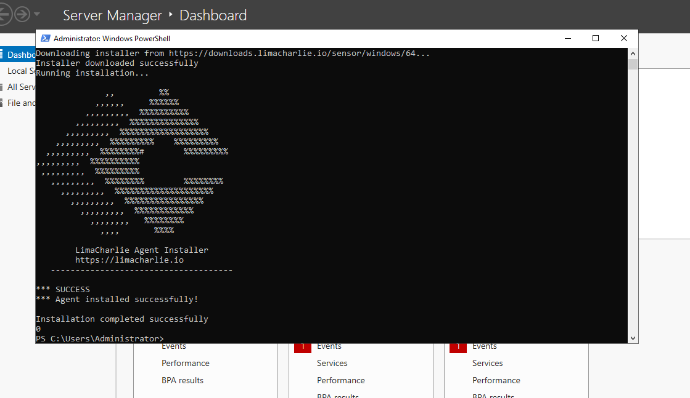
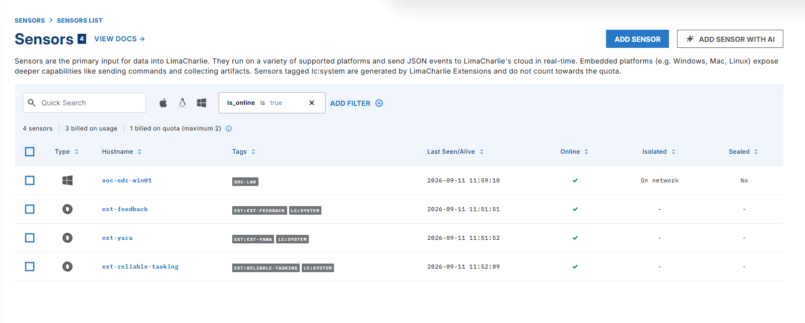
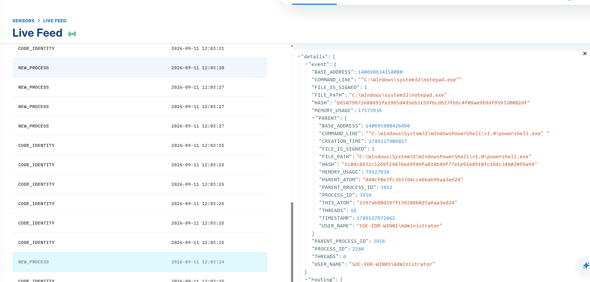

# Lab Setup

## Overview

This stage prepared the Windows endpoint for the SOC Response Automation project. I created a local Windows virtual machine in VirtualBox, enrolled it in LimaCharlie, and verified that endpoint activity was visible in the platform.

I used VirtualBox instead of the tutorial’s Vultr cloud instance to run the endpoint locally without cloud hosting costs.

## Lab Environment

| Component | Configuration |
|---|---|
| Virtualization platform | Oracle VirtualBox |
| Operating system | Windows Server 2022 Evaluation with Desktop Experience |
| Endpoint name | SOC-EDR-WIN01 |
| Network mode | NAT |
| EDR platform | LimaCharlie |
| Organization | SOC-Response-Automation |
| Sensor tag | soc-lab |

## 1. Windows VM Preparation

I installed Windows Server 2022 inside VirtualBox and configured the VM to use NAT networking. This provided the internet connectivity required to download the LimaCharlie sensor and communicate with its cloud platform.

The Windows VM serves as the monitored endpoint for the project. LimaCharlie is accessed through its web interface.

## 2. LimaCharlie Organization

I created a LimaCharlie organization named `SOC-Response-Automation` and selected **No template** to configure the project manually.

The organization initially displayed system extension sensors. These were separate from the Windows endpoint enrolled in the following steps.

## 3. Installation Key

I selected **Add Sensor**, chose Windows, and created an installation key with the following settings:

| Setting | Value |
|---|---|
| Description | SOC-EDR-WIN01-Installation |
| Tag | soc-lab |
| Use Public CA | Disabled |

The installation key associates the sensor with the correct LimaCharlie organization. The `soc-lab` tag is applied to sensors enrolled using that key.

Installation keys and other credentials are omitted from this documentation.

## 4. Sensor Installation

Inside the Windows VM, I opened PowerShell as administrator and ran the installation command provided by LimaCharlie.

The command downloaded the Windows sensor and installed it as a service. The installer reported that the agent installation completed successfully.



## 5. Endpoint Enrollment Verification

After installation, I returned to the LimaCharlie Sensors list and confirmed that the Windows endpoint appeared online.

This verified that the sensor had enrolled successfully and could communicate with the platform.



## 6. Telemetry Verification

I opened the sensor’s Live Feed to inspect incoming endpoint events.



To generate a recognizable test event, I launched Notepad from PowerShell inside the VM:

```powershell
notepad.exe
