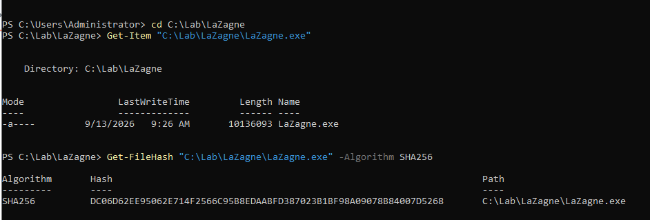
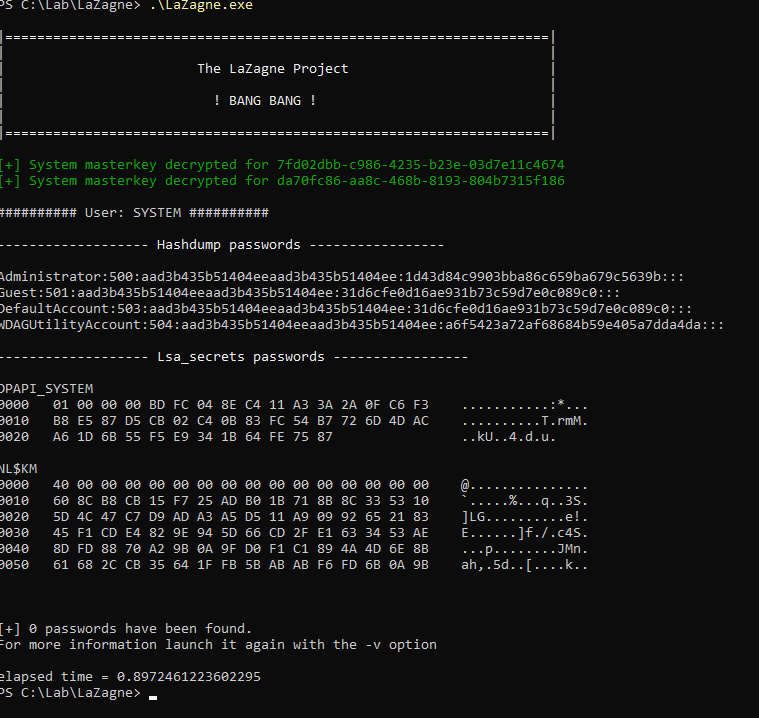
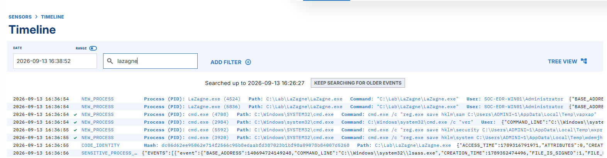
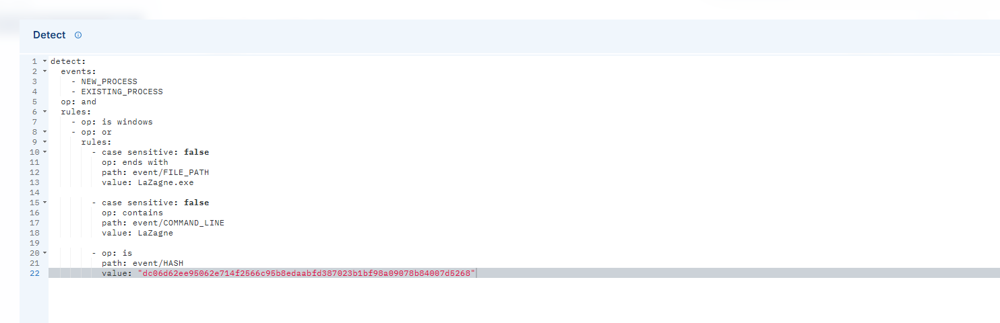
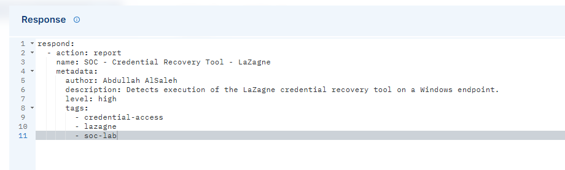
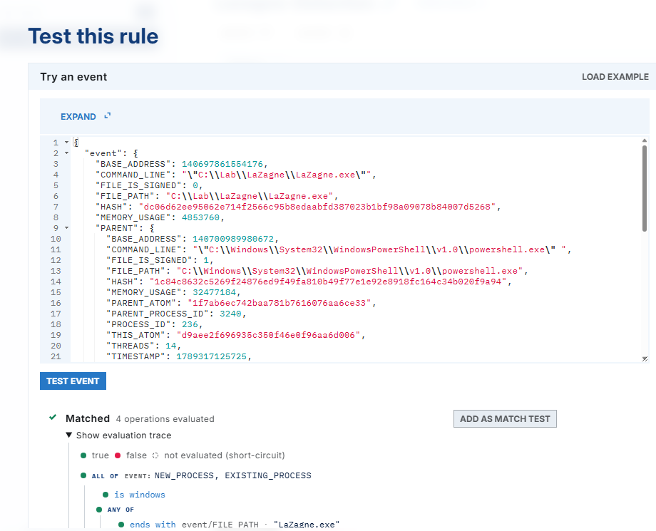
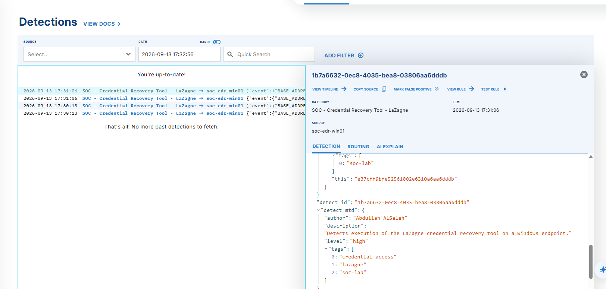

# LaZagne Detection Engineering

## Overview

This stage focused on generating credential-access telemetry and creating a custom LimaCharlie detection rule for the LaZagne credential-recovery tool.

LaZagne was executed inside the dedicated `SOC-EDR-WIN01` Windows lab endpoint. The resulting process activity was collected by the LimaCharlie sensor and used to develop, test, and validate a detection rule.

## Detection Environment

| Component | Configuration |
|---|---|
| Endpoint | SOC-EDR-WIN01 |
| Operating system | Windows Server 2022 Evaluation |
| Virtualization platform | Oracle VirtualBox |
| EDR platform | LimaCharlie |
| Test tool | LaZagne |
| Event types | NEW_PROCESS and EXISTING_PROCESS |
| Detection category | Credential Access |
| Rule name | soc-credential-recovery-lazagne |
| Alert severity | High |

## 1. LaZagne Download and Verification

LaZagne was downloaded from its official GitHub releases page and stored in the following lab directory:

```text
C:\Lab\LaZagne\LaZagne.exe
```

Before execution, I calculated the file's SHA-256 hash using PowerShell:

```powershell
Get-FileHash "C:\Lab\LaZagne\LaZagne.exe" -Algorithm SHA256
```

The resulting SHA-256 value was:

```text
dc06d62ee95062e714f2566c95b8edaabfd387023b1bf98a09078b84007d5268
```

The hash was later included as one of the detection conditions.



## 2. Test Activity Execution

I opened PowerShell inside the Windows lab endpoint and executed LaZagne using:

```powershell
cd C:\Lab\LaZagne
.\LaZagne.exe all
```

This generated credential-access activity and the process telemetry required to develop the detection rule.



Any credential values produced during testing were excluded from the project documentation.

## 3. Process Telemetry Analysis

After executing LaZagne, I opened the timeline for `SOC-EDR-WIN01` in LimaCharlie and searched for `LaZagne`.

LimaCharlie recorded a `NEW_PROCESS` event containing useful detection fields, including:

- Executable file path
- Command line
- SHA-256 hash
- Parent process
- Username
- Process ID
- Hostname
- Event timestamp



The event showed that LaZagne was launched from PowerShell with the `all` argument. The file path, command line, and hash were selected as detection indicators.

## 4. Detection Rule Development

I created a custom LimaCharlie Detection and Response rule named:

```text
soc-credential-recovery-lazagne
```

The detection evaluates `NEW_PROCESS` and `EXISTING_PROCESS` events generated on Windows endpoints.



The detection logic was configured as follows:

```yaml
events:
  - NEW_PROCESS
  - EXISTING_PROCESS
op: and
rules:
  - op: is windows
  - op: or
    rules:
      - case sensitive: false
        op: ends with
        path: event/FILE_PATH
        value: LaZagne.exe
      - case sensitive: false
        op: contains
        path: event/COMMAND_LINE
        value: LaZagne
      - op: is
        path: event/HASH
        value: "dc06d62ee95062e714f2566c95b8edaabfd387023b1bf98a09078b84007d5268"
```

The rule reports a match when the event originates from Windows and at least one of the following conditions is met:

- The executable path ends with `LaZagne.exe`.
- The command line contains `LaZagne`.
- The file hash matches the tested LaZagne executable.

Using multiple indicators improves coverage. The filename and command-line conditions identify ordinary LaZagne execution, while the hash can identify the tested executable even if its filename changes.

## 5. Detection Response Configuration

The response action was configured to generate a high-severity detection report when the rule matched.



```yaml
- action: report
  name: SOC - Credential Recovery Tool - LaZagne
  metadata:
    author: Abdullah AlSaleh
    description: Detects execution of the LaZagne credential recovery tool on a Windows endpoint.
    level: high
    tags:
      - credential-access
      - lazagne
      - soc-lab
```

The metadata identifies the rule's purpose, severity, author, and detection category. This information will also provide context when the detection is forwarded to the automation workflow.

## 6. Rule Testing

Before generating a live detection, I tested the rule against the previously captured LaZagne `NEW_PROCESS` event.

The event was copied from the endpoint timeline and inserted into LimaCharlie's rule-testing interface. The test confirmed that the event satisfied the detection logic.



This test verified that:

- The event type was supported.
- The event originated from Windows.
- The LaZagne file path and command line matched.
- The recorded SHA-256 hash matched the configured value.
- The report action could be triggered.

## 7. Live Detection Validation

After saving the rule, I executed LaZagne again on `SOC-EDR-WIN01`:

```powershell
.\LaZagne.exe all
```

LimaCharlie processed the new endpoint event and generated the custom detection:

```text
SOC - Credential Recovery Tool - LaZagne
```



This confirmed that the rule worked against live endpoint telemetry and successfully reported LaZagne execution.

## Detection Logic Summary

| Condition | Field | Match type |
|---|---|---|
| Windows endpoint | Platform | Platform check |
| LaZagne executable name | `event/FILE_PATH` | Ends with |
| LaZagne command | `event/COMMAND_LINE` | Contains |
| Known executable hash | `event/HASH` | Exact match |

The conditions inside the `or` group are evaluated independently. Only one indicator must match after LimaCharlie confirms that the event originated from a Windows endpoint.

## Results

| Validation Check | Outcome |
|---|---|
| LaZagne downloaded from the official repository | Completed |
| SHA-256 hash calculated | Completed |
| LaZagne executed in the lab | Completed |
| Process telemetry collected | Verified |
| `NEW_PROCESS` event identified | Verified |
| Custom detection logic created | Completed |
| Report response configured | Completed |
| Rule tested against captured telemetry | Passed |
| Live detection generated | Successful |

## Security Considerations

LaZagne can recover credentials stored on a Windows system. It was used only inside a dedicated and authorized virtual lab endpoint.

Recovered credentials, installation keys, API keys, and other sensitive values are excluded from this repository. The executable itself is also excluded from the repository.

## Next Stage

The custom detection is now ready to be integrated with Tines. The next stage will forward LimaCharlie detections to a Tines Story, send Slack and email notifications, and request analyst approval before isolating the endpoint.

[Return to the project overview](../README.md)
