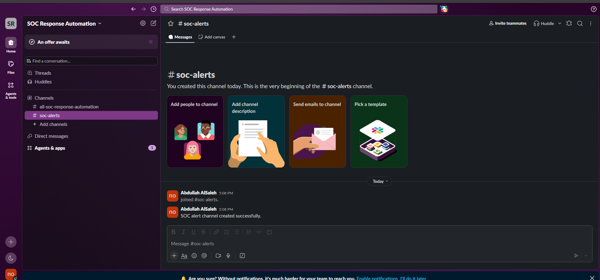
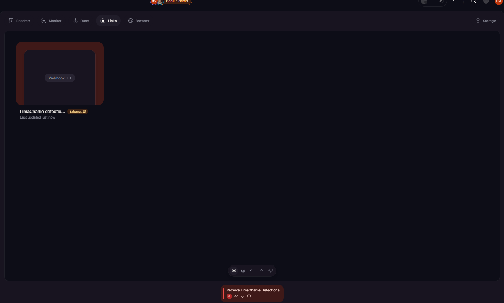
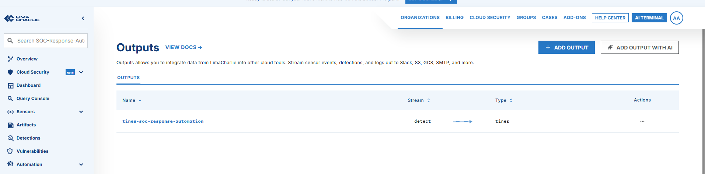
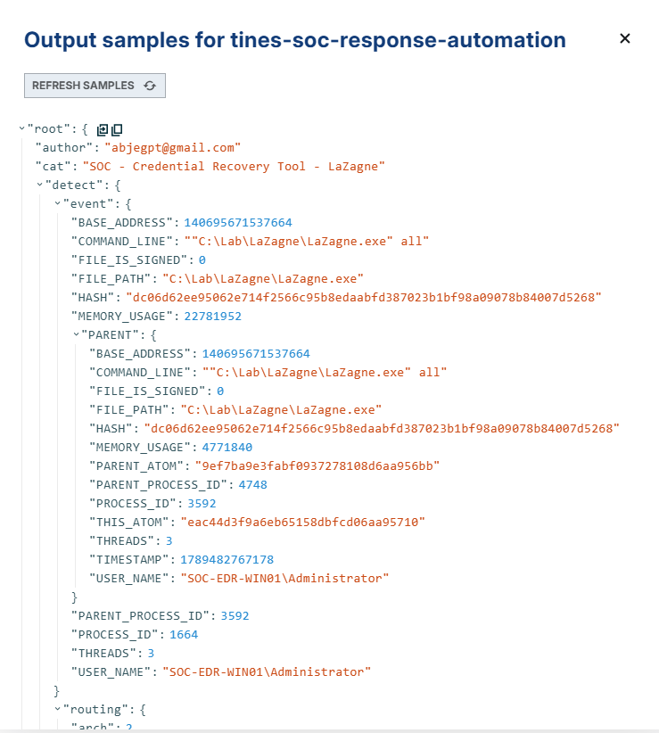
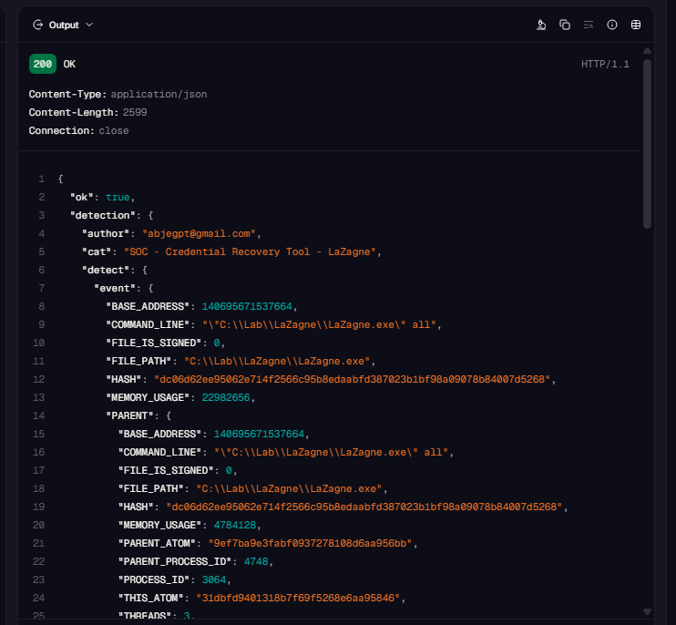

# Automation Integration

## Overview

This stage established the connection between LimaCharlie and Tines so that endpoint detections could be forwarded automatically to the response workflow.

I also created a dedicated Slack workspace and alert channel in preparation for the notification actions that will be implemented during the final stage.

## Integration Environment

| Component | Purpose |
|---|---|
| LimaCharlie | Generates and forwards endpoint detections |
| Tines 3B | Receives detections and runs the automation workflow |
| Tines webhook | Provides the entry point for LimaCharlie detections |
| Slack | Receives security alerts and response-status messages |
| Windows endpoint | Generates the monitored LaZagne activity |
| Detection rule | Identifies LaZagne execution |

## 1. Playbook Design

Before configuring the automation platforms, I designed a playbook showing the intended detection and response process.


The planned workflow performs the following actions:

1. LimaCharlie detects the execution of a credential-recovery tool.
2. The detection is forwarded to Tines.
3. Tines sends notifications through Slack and email.
4. The analyst decides whether to isolate the affected endpoint.
5. LimaCharlie isolates the endpoint if the analyst approves the action.
6. Slack receives a final message showing the response outcome.

This stage implemented and tested the connection between LimaCharlie and Tines. Notification and endpoint-isolation actions will be added during the final stage.

## 2. Slack Workspace and Alert Channel

I created a Slack workspace named:

```text
SOC Response Automation
```

A dedicated public channel named `soc-alerts` was created for security notifications and endpoint response updates.

The channel description was configured as:

```text
Security alerts and endpoint response notifications from the SOC automation workflow.
```



Using a separate alert channel keeps automated security messages organized and provides analysts with a clear location for detection and response updates.

## 3. Tines Workflow Creation

The current Tines 3B interface uses AI Chat to create and manage workflows. This differs from the older interface shown in the original tutorial, where workflows were called Stories and were built through a drag-and-drop storyboard.

I created a personal workflow named:

```text
SOC Response Automation
```

For this stage, the workflow contained one webhook trigger:

```text
Receive LimaCharlie Detections
```

The webhook was configured to:

- Accept HTTP POST requests.
- Accept JSON request bodies.
- Preserve the complete incoming detection payload.
- Return HTTP status `200` for valid requests.
- Reject unsupported request methods.
- Reject invalid JSON requests.

## 4. Tines Detection Webhook

The workflow was published with an unguessable external-ID URL. This allowed LimaCharlie to reach the webhook without exposing a simple public route.



The complete webhook URL and its `external_id` value are excluded from this repository.

The webhook acts as the entry point for the automation:

```text
LimaCharlie Detection → Tines Webhook → Automation Workflow
```

At this stage, no Slack, email, or isolation steps were connected to the webhook. These actions will be implemented during the final automation stage.

## 5. LimaCharlie Detection Output

Inside the LimaCharlie organization, I created an output named:

```text
tines-soc-response-automation
```

The output was configured with the following settings:

| Setting | Value |
|---|---|
| Output stream | Detections |
| Destination | Tines |
| Destination host | Tines external-ID webhook URL |
| Output name | tines-soc-response-automation |



The **Detections** stream was selected so that LimaCharlie forwards detection reports produced by the rule engine instead of sending every endpoint event.

## 6. Integration Test

To test the connection, I executed LaZagne again inside the Windows lab endpoint:

```powershell
cd C:\Lab\LaZagne
.\LaZagne.exe all
```

The custom LimaCharlie rule detected the activity and generated the following alert:

```text
SOC - Credential Recovery Tool - LaZagne
```

LimaCharlie then processed the new detection through the Tines output.



This confirmed that the output was active and that a detection was available for delivery to the Tines webhook.

## 7. Detection Received by Tines

After the LimaCharlie detection was generated, I opened the Tines workflow execution history and inspected the latest execution of the `Receive LimaCharlie Detections` webhook.



The incoming JSON payload included the information required for the response workflow, such as:

- Detection name
- Event timestamp
- Endpoint hostname
- Command line
- Executable file path
- File hash
- Username
- Sensor ID
- Detection metadata

The received payload matched the detection information produced by LimaCharlie. This verified that the complete detection could be used by later workflow steps.

## Data Flow

```text
LaZagne executed on SOC-EDR-WIN01
                ↓
LimaCharlie sensor collects the process event
                ↓
Custom D&R rule generates a detection
                ↓
LimaCharlie detection output sends an HTTP POST request
                ↓
Tines webhook receives the JSON detection
                ↓
Detection becomes available to the automation workflow
```

## Validation Results

| Validation Check | Outcome |
|---|---|
| Slack workspace created | Completed |
| Dedicated `soc-alerts` channel created | Completed |
| Tines workflow created | Completed |
| Incoming webhook configured | Completed |
| Webhook published | Completed |
| LimaCharlie detection output created | Completed |
| New LaZagne detection generated | Successful |
| Detection forwarded to Tines | Successful |
| Incoming JSON payload preserved | Verified |
| LimaCharlie-to-Tines connection | Validated |

## Security Considerations

The Tines webhook uses an unguessable external-ID URL. The full URL is treated as a secret because anyone possessing it may be able to send data to the workflow.

The following values are excluded or hidden from the repository screenshots:

- Tines webhook URL
- External ID
- Installation keys
- API credentials
- Recovered passwords
- Sensitive endpoint information

## Next Stage

The LimaCharlie-to-Tines integration is working successfully. The final stage will extend the workflow to:

- Format the incoming detection.
- Send Slack and email notifications.
- Present the analyst with an endpoint-isolation decision.
- Send the approved isolation request to LimaCharlie.
- Confirm whether the endpoint was isolated.
- Send the final response status to Slack.

[Return to the project overview](../README.md)
