# Part 5 — Automated Response and Endpoint Isolation

## Overview

This stage completed the SOC Response Automation workflow by adding Slack and email notifications, human analyst approval, automated endpoint isolation, and endpoint recovery.

When LimaCharlie detects LaZagne execution, the detection is forwarded to the automation workflow. Slack and email alerts notify the analyst and provide a unique decision link. The analyst can either isolate the endpoint or leave it connected.

## Workflow

The completed workflow performs the following actions:

1. Receives a detection from LimaCharlie.
2. Creates a unique pending decision record.
3. Sends the detection to Slack.
4. Sends the detection by email.
5. Presents the analyst with an isolation decision page.
6. Routes the decision through the Yes or No branch.
7. Isolates the endpoint if the analyst selects Yes.
8. Leaves the endpoint connected if the analyst selects No.
9. Sends the result to Slack.

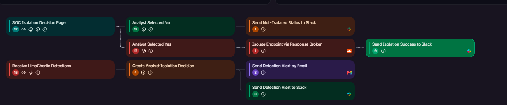

## 1. Slack Connector

I created a Slack connector and authorized it to communicate with the project workspace.

The connector was configured for the `soc-alerts` channel, which is used for detection and response notifications.

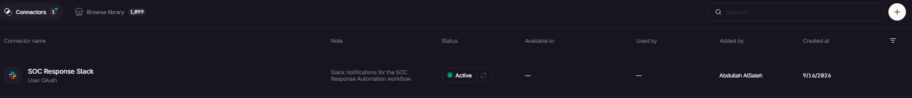

I tested the connector to confirm that the automation platform could successfully send messages to Slack.

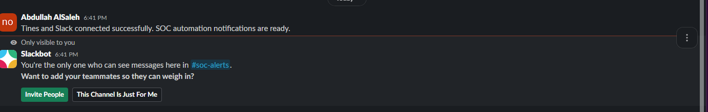

## 2. Slack Detection Alert

I added a permanent Slack notification step after the LimaCharlie detection webhook.

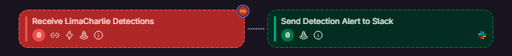

The Slack alert contains the following detection information:

- Detection title
- Computer name
- Username
- Source IP address
- File path
- Command line
- Sensor ID
- Analyst decision link

A LaZagne detection was generated on the Windows endpoint, and the workflow successfully delivered the alert to the `soc-alerts` channel.

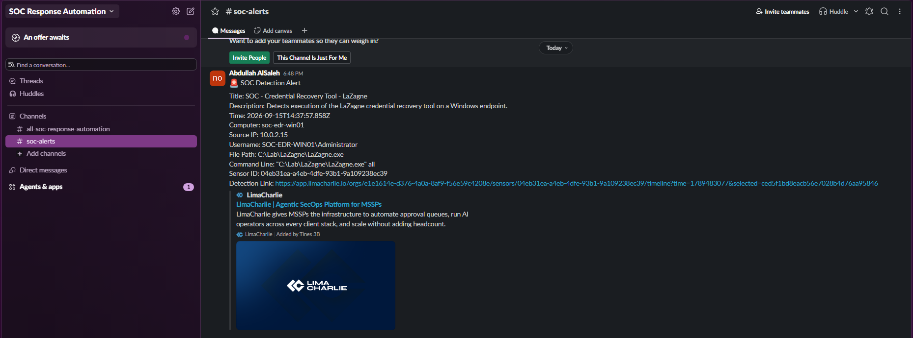

## 3. Email Detection Alert

I added an email notification step to provide a second notification method.

The email contains the detection information and the analyst decision link.

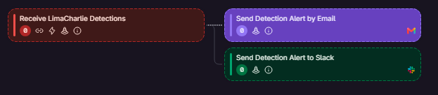

The detection email was successfully delivered.

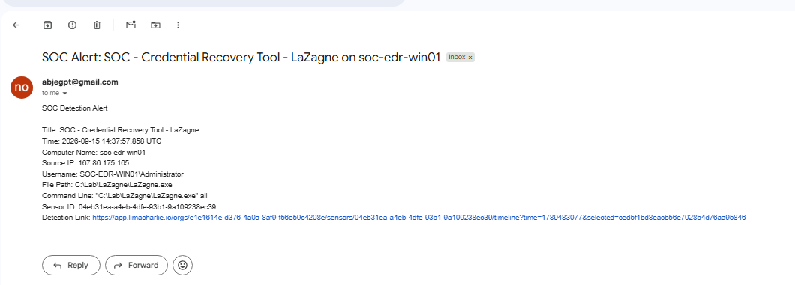

## 4. Analyst Decision Links

Each new detection creates a unique UUID-backed pending decision record.

The record preserves:

- Original detection payload
- Decision ID
- Sensor ID
- Computer name
- Creation time
- Decision status

The decision link was successfully included in the Slack notification.

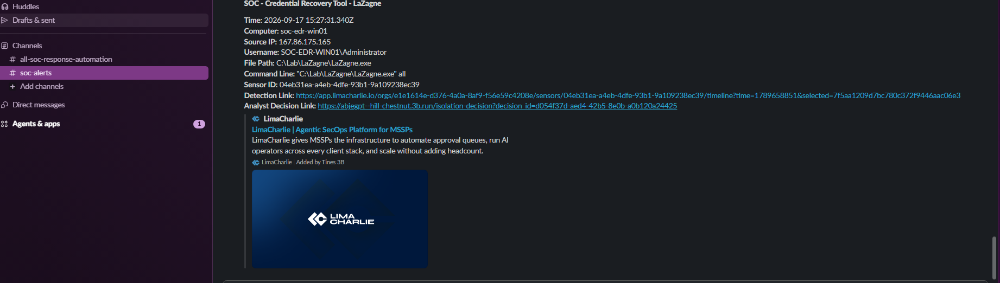

The same decision link was also included in the email notification.

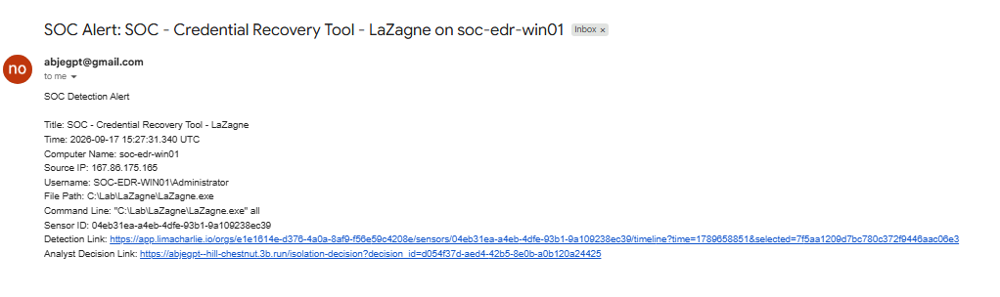

Each decision link is associated with one detection and can only be submitted once.

## 5. Endpoint Isolation Decision Page

Opening the analyst decision link displays the detection information and asks whether the endpoint should be isolated.

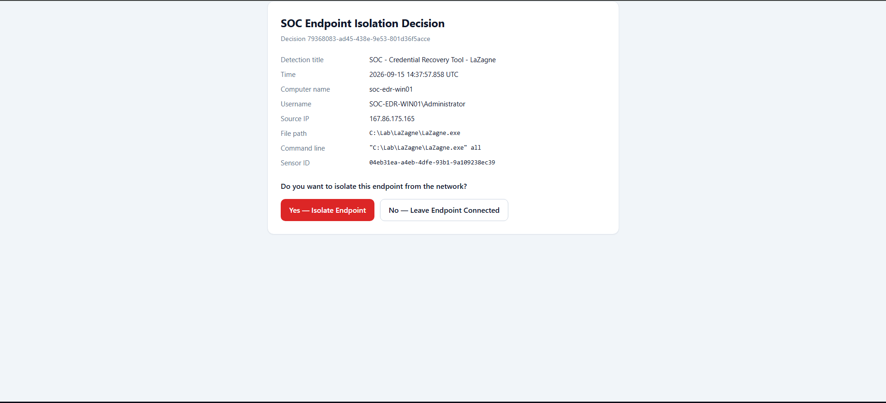

The analyst has two options:

- **Yes — Isolate Endpoint**
- **No — Leave Endpoint Connected**

The workflow contains separate response branches for these decisions.


## 6. LimaCharlie API Permissions

I created a dedicated LimaCharlie API key for the response workflow.

The key was granted only the `sensor.task` Write permission required to issue a response command to the endpoint.

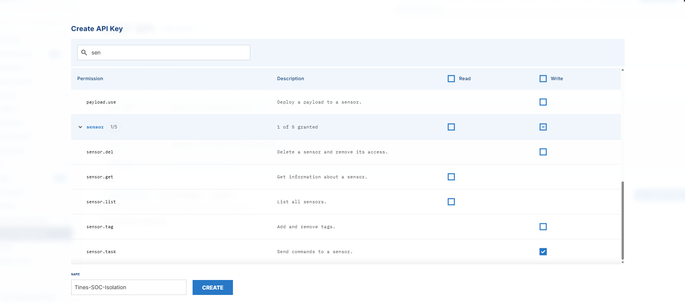

The actual API key and all other credentials are excluded from this repository.

## 7. Cloudflare Response Broker

The automation platform could not directly complete LimaCharlie’s temporary JWT authentication process. To solve this problem securely, I deployed a Cloudflare Worker named `soc-isolation-broker`.

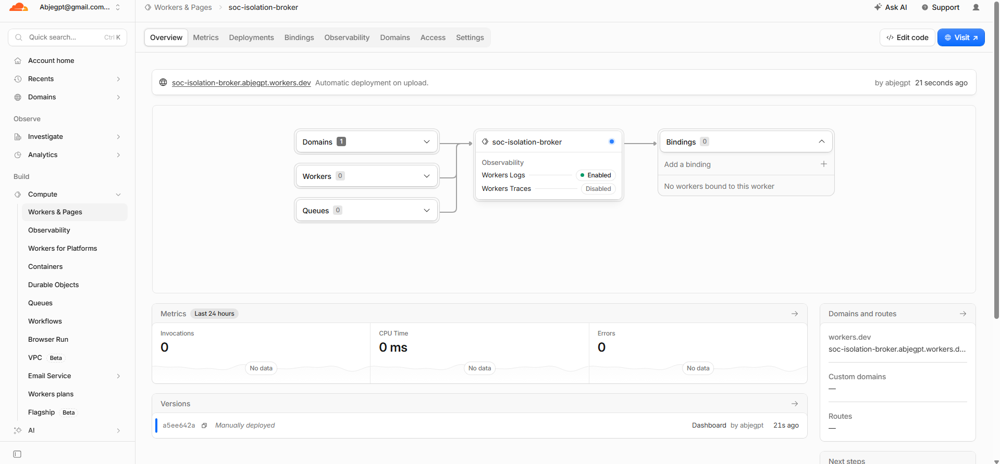

The Worker stores the following values as encrypted secrets:

- LimaCharlie organization ID
- LimaCharlie API key
- Webhook authentication secret

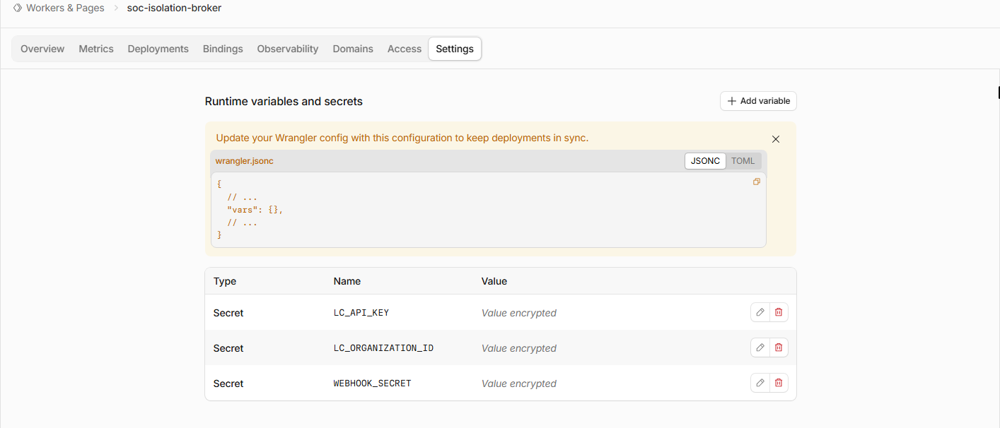

Only the secret names are visible in the screenshot. Their values are not exposed.

The Worker performs the following process:

1. Receives an authenticated request from the automation workflow.
2. Validates the HTTP method and Sensor ID.
3. Exchanges the LimaCharlie API credentials for a temporary JWT.
4. Sends the isolation request to the LimaCharlie API.
5. Returns a safe response without exposing credentials.

## 8. Isolation Broker Connector

I created a connector named `SOC Isolation Broker`.

The connector is restricted to the Cloudflare Worker address and supplies the webhook Bearer credential securely.

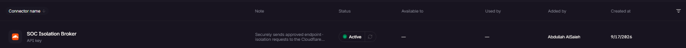

The isolation action sends a POST request to the Worker containing the Sensor ID from the analyst’s decision.

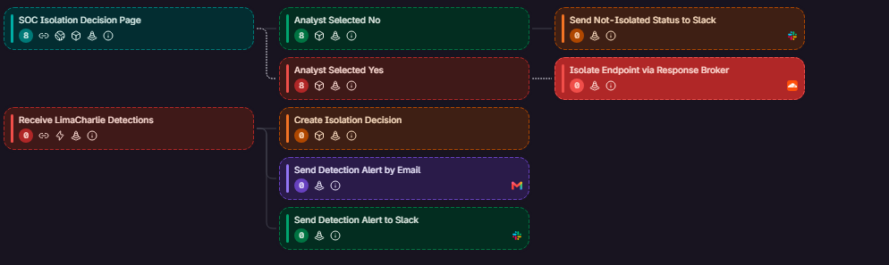

The request uses the following structure:

```json
{
  "sensor_id": "<dynamic Sensor ID>"
}
```

The action is successful only when the response returns HTTP status `200` and `"ok": true`.

## 9. Endpoint State Before Isolation

Before testing the Yes branch, I confirmed that `SOC-EDR-WIN01` was online and connected.

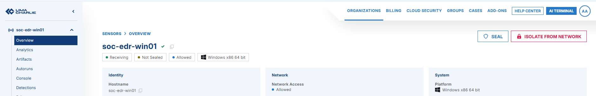

I started a continuous ping inside the Windows VM to demonstrate its network connectivity before isolation.

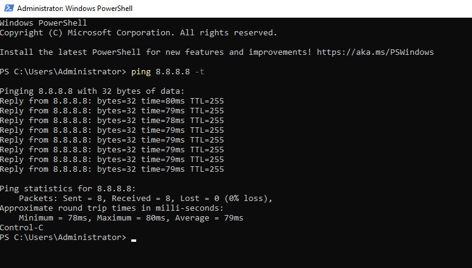

## 10. Analyst Approves Isolation

A new LaZagne detection was generated, and the analyst decision page displayed the correct detection and endpoint information.

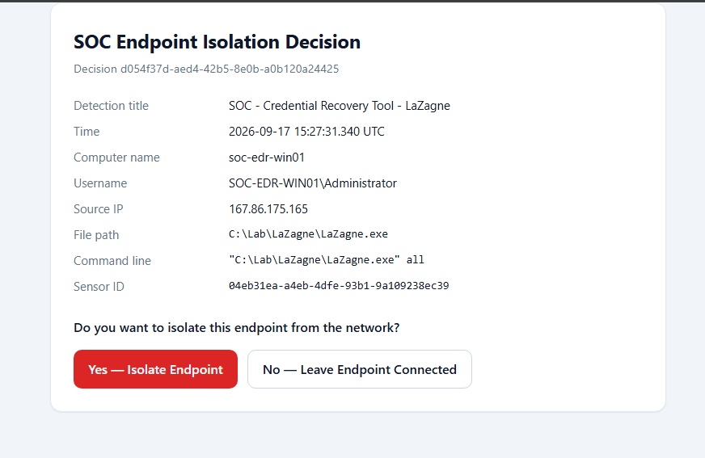

I selected **Yes — Isolate Endpoint**.

The decision page confirmed that the decision was recorded and that the Yes branch was triggered.

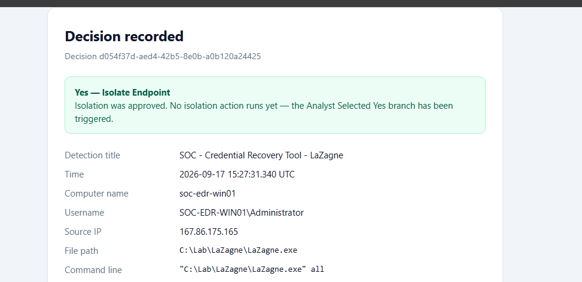

The decision could not be submitted again because the workflow uses one-time submission protection.

## 11. Endpoint Isolation Verification

The Yes branch sent the selected Sensor ID to the Cloudflare response broker. The broker authenticated with LimaCharlie and isolated the endpoint.

After isolation, the continuous ping stopped receiving replies.

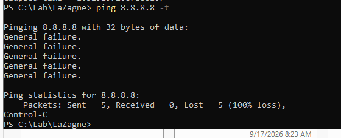

LimaCharlie also showed that `SOC-EDR-WIN01` was isolated.

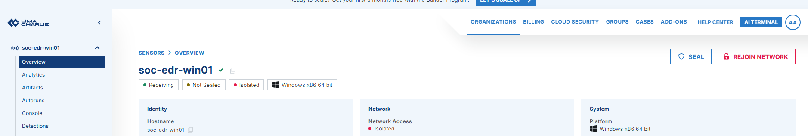

These results confirmed that the automated response action successfully blocked the endpoint’s normal network connectivity.

## 12. Endpoint Recovery

After verifying the isolation, I removed the endpoint from isolation through LimaCharlie.

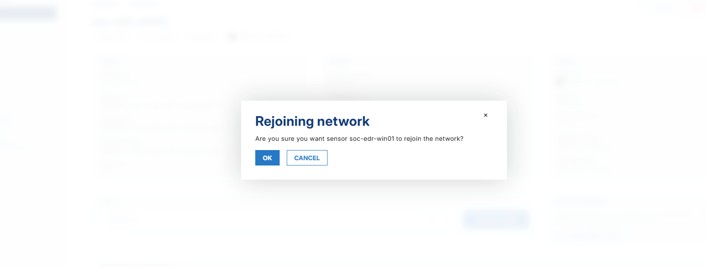

The continuous ping began receiving replies again, confirming that network connectivity had been restored.

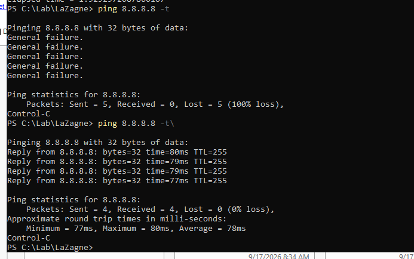

## 13. No Branch Test

I generated another LaZagne detection to test the No branch with a new decision record.

The analyst selected **No — Leave Endpoint Connected**.


The workflow recorded the No decision without calling the Cloudflare isolation broker.

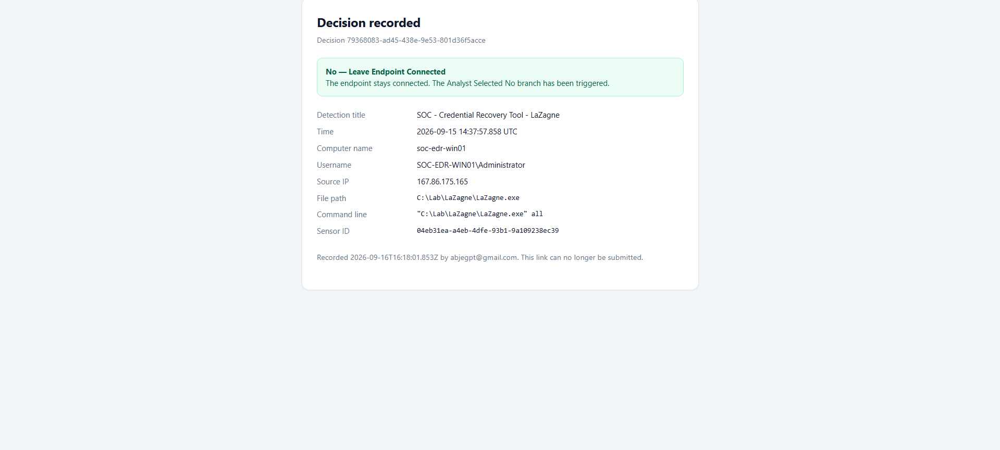

The endpoint continued receiving successful ping replies.

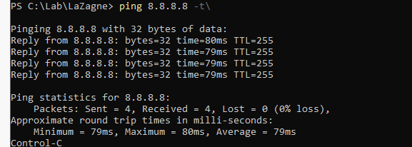

Slack received a notification confirming that the analyst decided not to isolate the endpoint.

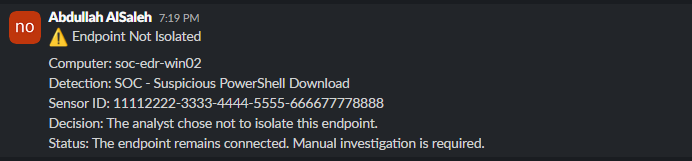

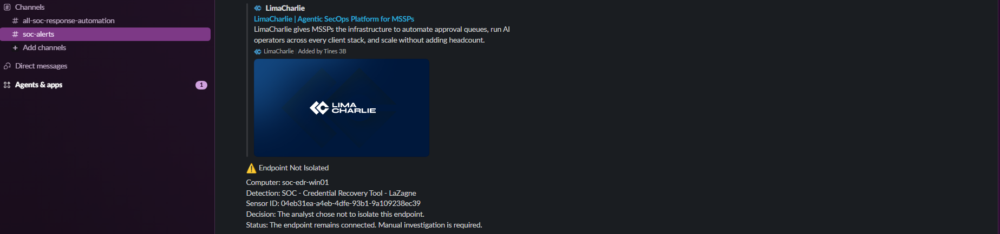

## 14. Test Results

| Test | Expected Result | Actual Result |
|---|---|---|
| Slack connector | Connector becomes active | Passed |
| Slack detection alert | Alert appears in `soc-alerts` | Passed |
| Email detection alert | Email is delivered | Passed |
| Decision record | Unique decision ID is created | Passed |
| One-time decision | Decision cannot be submitted twice | Passed |
| Yes branch | Endpoint is isolated | Passed |
| Isolation connectivity test | Ping stops receiving replies | Passed |
| LimaCharlie verification | Endpoint displays as isolated | Passed |
| Endpoint recovery | Isolation is removed | Passed |
| Recovery connectivity test | Ping replies return | Passed |
| No branch | Endpoint remains connected | Passed |
| No-branch Slack notification | Status appears in Slack | Passed |

## Security Controls

The workflow includes the following security controls:

- LimaCharlie permissions follow the principle of least privilege.
- API keys, JWTs, passwords, and webhook secrets are excluded from GitHub.
- Cloudflare stores credentials as encrypted secrets.
- The response broker requires Bearer authentication.
- The Worker validates the Sensor ID format.
- Each analyst decision uses a unique UUID.
- Each decision can only be submitted once.
- Isolation requires explicit analyst approval.
- The Yes and No response branches are separated.
- Failed isolation requests are not automatically retried.
- Decision URLs and credentials are not included in the documentation.

## Results

The completed workflow successfully demonstrated an end-to-end SOC response process:

- LimaCharlie detected LaZagne execution.
- The detection was forwarded to the automation workflow.
- Slack and email alerts were generated.
- The analyst reviewed the detection.
- Selecting Yes isolated the Windows endpoint.
- Network connectivity stopped after isolation.
- The endpoint was successfully restored.
- Connectivity returned after recovery.
- Selecting No left the endpoint connected.
- Slack recorded the result of both analyst decisions.

## Conclusion

This stage completed the SOC Response Automation project by connecting detection, notification, human approval, endpoint containment, and recovery within one workflow.

The project demonstrates a human-in-the-loop SOAR process in which suspicious credential-recovery activity is detected by LimaCharlie, reported through Slack and email, reviewed by an analyst, and handled through controlled Yes and No response branches. Testing confirmed that an approved endpoint could be isolated and restored successfully, while a rejected isolation request left the endpoint connected.
