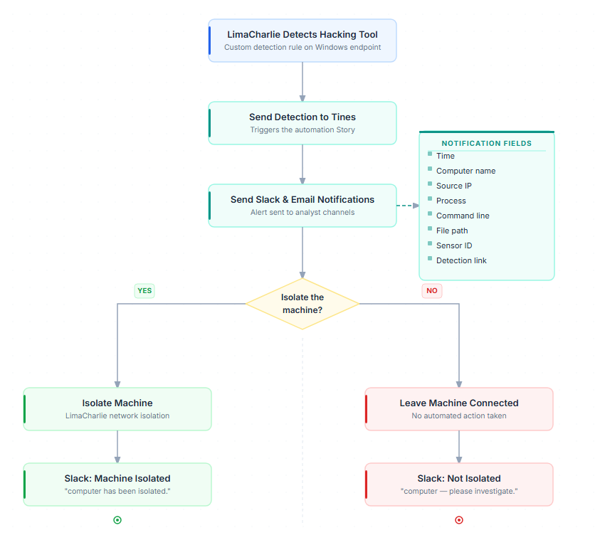

# SOC Response Automation

A personal cybersecurity project using **LimaCharlie** and **Tines** to detect suspicious endpoint activity and automate notifications and analyst-approved containment.

## Project Overview

This project connects endpoint detection with an automated response workflow. LimaCharlie detects the execution of a hacking tool on a Windows virtual machine and forwards the detection to Tines.

The Tines workflow sends Slack and email notifications, then asks an analyst whether to isolate the affected machine. If approved, LimaCharlie isolates the endpoint. If declined, the machine remains connected and a Slack message requests further investigation.

**Status:** In progress — playbook workflow designed; implementation and testing underway.

## Objectives

- Collect endpoint telemetry from a Windows virtual machine.
- Create and test a custom LimaCharlie detection rule.
- Forward detections to Tines to trigger an automated workflow.
- Send useful alert details through Slack and email.
- Require analyst approval before isolating an endpoint.
- Test and document both approval and rejection outcomes.

## Tools Used

| Tool | Role |
|---|---|
| Windows VM | Lab endpoint used to generate activity and test the response. |
| LimaCharlie | Endpoint telemetry, custom detection, and network isolation. |
| Tines | Workflow orchestration and response automation. |
| Slack | Alert notifications and response status updates. |
| Email | Additional alert notifications. |

## Playbook Workflow

1. **Detect:** A custom LimaCharlie rule identifies suspicious tool execution.
2. **Trigger:** The detection is forwarded to Tines.
3. **Notify:** Tines sends the alert details through Slack and email.
4. **Request approval:** The analyst decides whether to isolate the endpoint.
5. **Respond:**
   - **Approved:** LimaCharlie isolates the endpoint, and Slack receives an isolation status update.
   - **Declined:** The endpoint remains connected, and Slack receives a message requesting investigation.

### Notification Details

Notifications are designed to include the following fields, where available:

- Event time
- Computer name
- Source IP
- Process
- Command line
- File path
- Sensor ID
- Detection link

## Project Documentation

| Stage | Documentation |
|---|---|
| [01 — Lab Setup](01-Lab-Setup/) | Windows VM preparation, sensor installation, and connectivity verification. |
| [02 — Detection](02-Detection/) | Custom detection rule, test activity, and detection evidence. |
| [03 — Automation](03-Automation/) | Playbook diagram, Tines workflow, notifications, and approval logic. |
| [04 — Testing and Results](04-Testing-and-Results/) | End-to-end test outcomes, isolation verification, and lessons learned. |

## Validation Plan

The completed workflow will be tested to confirm that:

- Test activity triggers the intended detection.
- Tines receives and processes the detection.
- Slack and email notifications contain the expected details.
- Approving isolation results in a confirmed isolated endpoint.
- Declining isolation leaves the endpoint connected.
- Response messages accurately reflect the outcome.

## Lab Scope

All testing is performed on a dedicated lab virtual machine. Credentials, API keys, and sensitive configuration values are excluded from this repository.
